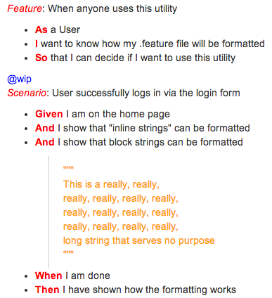

# .feature to JIRA comment formatter

This is a simple utility takes in a .feature file and returns a JIRA comment friendly formatted version of it via stdout, so it's great in combination with piping or redirecting.

## Installation

```sh
curl -fsSL https://raw.github.com/sqow/feature-to-jira/master/f2j -o /usr/local/bin/f2j; chmod a+x /usr/local/bin/f2j;
```

## Usage

```sh
cd repo
f2j test.feature
```

I've found that this utility works especially well with copying directly to the clipboard like so:
```sh
f2j test.feature | pbcopy
```

The utility can also handle multiple files at once, should that be what you're after:
```sh
f2j test.feature test2.feature
```

## Example

### Feature file

```Cucumber
Feature: When anyone uses this utility
  As a User
  I want to know how my .feature file will be formatted
  So that I can decide if I want to use this utility

@wip
Scenario: User successfully logs in via the login form
  Given I am on the home page
  And I show that "inline strings" can be formatted
  And I show that block strings can be formatted
  """
  This is a really, really,
  really, really, really, really,
  really, really, really, really,
  really, really, really, really,
  long string that serves no purpose
  """
  When I am done
  Then I have shown how the formatting works
```

### Raw output

{color:red}\_Feature\_{color}: When anyone uses this utility<br>
\*  {color:red}\*As\*{color} a User<br>
\*  {color:red}\*I\*{color} want to know how my .feature file will be formatted<br>
\*  {color:red}\*So\*{color} that I can decide if I want to use this utility<br>
<br>
{color:blue}@wip{color}<br>
{color:red}\_Scenario\_{color}: User successfully logs in via the login form<br>
\*  {color:red}\*Given\*{color} I am on the home page<br>
\*  {color:red}\*And\*{color} I show that "inline strings" can be formatted<br>
\*  {color:red}\*And\*{color} I show that block strings can be formatted<br>
{quote}{color:orange}"""<br>
This is a really, really,<br>
really, really, really, really,<br>
really, really, really, really,<br>
really, really, really, really,<br>
long string that serves no purpose<br>
"""{color}{quote}<br>
\*  {color:red}\*When\*{color} I am done<br>
\*  {color:red}\*Then\*{color} I have shown how the formatting works

### Raw output put into a JIRA comment


